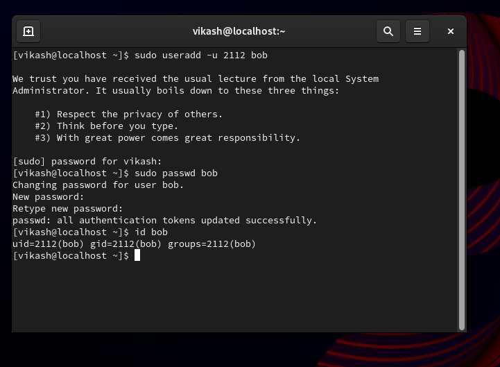

# Creating User 'bob' with UID 2112 and Setting the Password

To create a user named 'bob' with a specific UID of 2112 and set the password to 'trootent', we will follow the following step. These commands should be executed with root privileges or using `sudo` in a terminal.

## Step-by-Step Guide

1. **Create the user 'bob' with a specific UID:**

    ```bash
    sudo useradd -u 2112 bob
    ```

2. **Set the password for the user 'bob':**

    ```bash
    sudo passwd bob
    ```

    When prompted, enter 'trootent' as the password.

3. **Verification:**

    To verify that the user 'bob' has been created with the correct UID, you can use the following command:

    ```bash
    id bob
    ```

    The output should show the UID 2112 for the user 'bob':

    ```bash
    uid=2112(bob) gid=2112(bob) groups=2112(bob)
    ```

## Screenshot

Below is a screenshot demonstrating the commands executed in the terminal:



## Conclusion

By following these steps, we have successfully created a user named 'bob' with UID 2112 and set their password to 'trootent'. This process ensures that the user is set up with the specified UID and can log in using the given password.